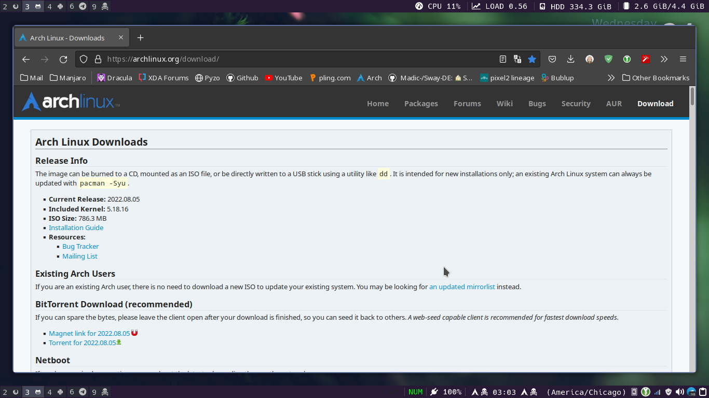
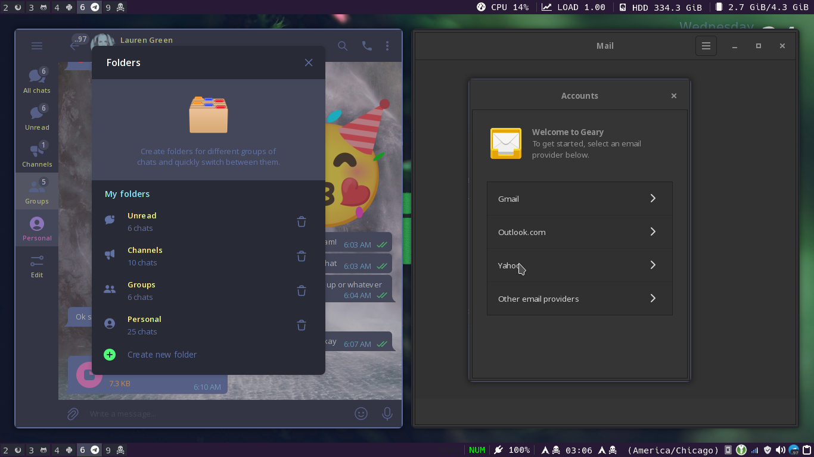
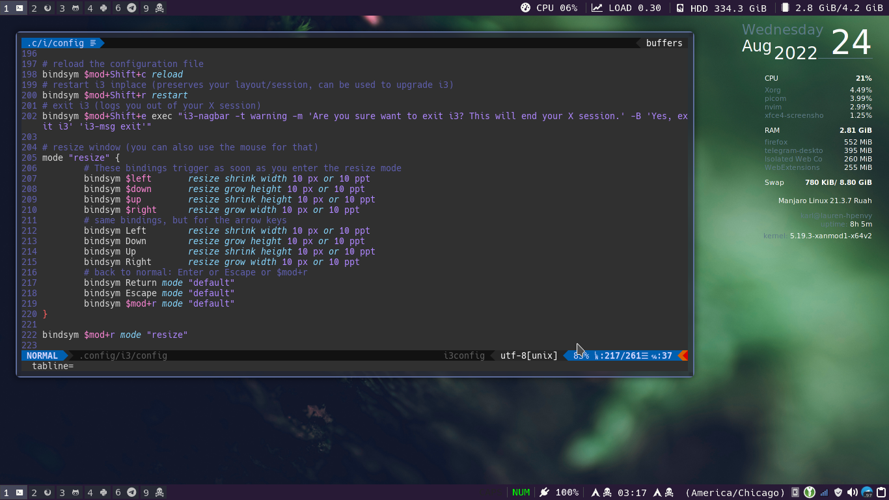
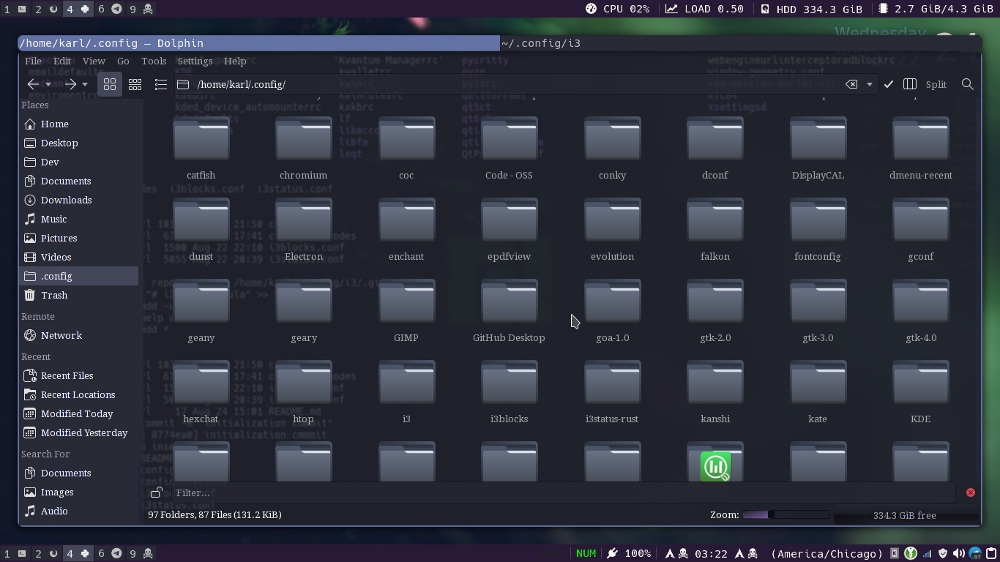

# i3rice-dracula
contact me on telegram @linuxkarl615 or by email at karlhaines615@yahoo.com if you have any questions or comments! Thanks for visiting!
## My first rice, i3 on X11
I created this config by starting with the default and just hacking away bit by bit, trying out different programs, wm's and 
so on, until I really started to get proud of what I was working on! I got started with this from checking out some of the other 
people's setups on the unixporn subreddit.

I already had quite a bit of experience with themes and configuring things, etc. I've been a Linux user for 20 years now so I'm 
certainly not skiddish about editing a config file to get an app to run how I need it to, which is all this is. I had recenly gotten 
quite obsessed with the [dracula theme](https://draculatheme.com/), and realizing all of the work that had been put into it, 
(literally theming over 250 apps!), I decided that there was no better foundation for a great looking rice! THANKS AGAIN [Zeno Rocha](https://zenorocha.com/) for all of the effort you put in to provide us with so much to work with, you've done an EXCELLENT JOB!

ANYWAY. On to the rice....

# Information about the setup
- system is running Manjaro Linux, its an HP Envy laptop with a Radeon graphics card
- i3-gaps for the window manager
- most of my apps are qt based by preference, as I like to use kvantum for its many useful features
- dracula kde/qt, kvantum, gtk2, 3, and 4 themes are all in effect to keep everything very uniform
- I'm using py3status to fill my top bar, as I am a python loving maniac!
- Currently, I'm using i3blocks on the bottom bar, but py3status is capable of using i3blocks as well, so I'll probably move to something else on the bottom bar shortly. (perhaps conky, or maybe lemonbar, not really sure yet, but I'm planning something special!)
- Of course I'm using Fontawesome and Powerline fonts, only the best for me!
- kitty terminal (which powers most of the nice terminals these days, alacritty and konsole are both kitty-based terminals)
  - a hint further, kitty (IMHO) has excellent configurability, performace, and a freaking SWEET builtin tab interface with powerline-styed tabs that are completely customizable, look for a really nice tab setup for kitty coming for this rice soon as well
- rofi and bemenu for executing anything i dont have a key-combo configured for
  - rofi is also dracula themed to match
- NVIM for my editor, nvim inside the terminal and nvim-qt if detected to be on the desktop
  - guess what? my nvim is dracula themed as well, LOL
- other dracula themed apps I'm using, firefox and qutebrowser, zsh shell, geany IDE, geary email (inherits gtk's dracula)

Well, thats about all I can think of at this moment. How about some screenshots? I'm sure you're tired of hearing me blabber!

